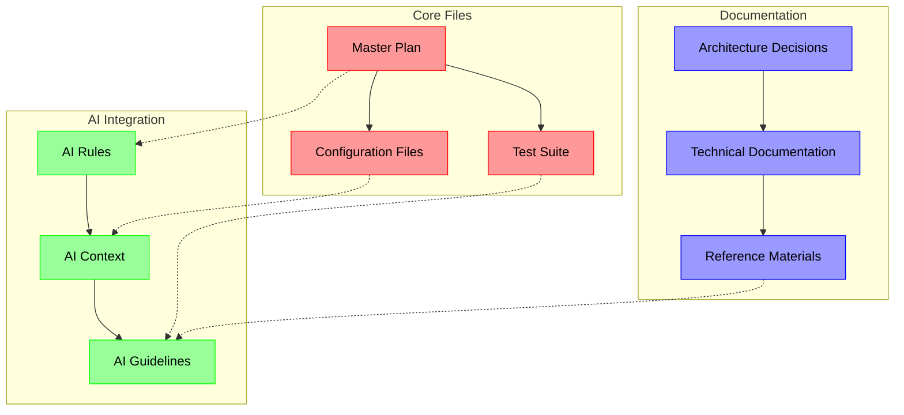

Vibe-coding works best when a *handful of lightweight, living docs* give you quick context without dragging you out of flow. Below is a distilled “starter kit” of **ten extra files/folders** (beyond the usual `README`, `CONTRIBUTING`, etc.) that seasoned indie and OSS projects adopt to stay in the groove.

## 1 Orientation & Vision

| File                 | Why it matters                                                                                                                                                                                                                                                                                                                |
| -------------------- | ----------------------------------------------------------------------------------------------------------------------------------------------------------------------------------------------------------------------------------------------------------------------------------------------------------------------------- |
| **`VISION.md`**      | A one-pager that states *why* the project exists, the problem it solves, and what success looks like. A clear vision reduces thrash and keeps experiments coherent. ([ibm.com][1], [ecampusontario.pressbooks.pub][2])                                                                                                        |
| **`MASTER_PLAN.md`** | Breaks the vision into high-level epics or “chunks of work.” It’s not a sprint board—think of it as your personal north-star outline you rewrite freely when inspiration strikes. Organize tasks chronologically or by energy level so you can pick work that matches your vibe. ([mozillascience.github.io][3], [dev.to][4]) |

## 2 Evolution & Planning

| File / Folder        | Purpose                                                                                                                                                                                                                                                     |
| -------------------- | ----------------------------------------------------------------------------------------------------------------------------------------------------------------------------------------------------------------------------------------------------------- |
| **`ROADMAP.md`**     | Public, milestone-oriented path (“Now / Next / Later”). Helps collaborators see what’s cooking without pinging you. ([mozillascience.github.io][3], [dev.to][4])                                                                                            |
| **`CHANGELOG.md`**   | Human-readable release notes following *Keep a Changelog*—date-stamped, grouped by *Added/Changed/Fixed*. Doubles as a reflective journal. ([keepachangelog.com][5], [getbeamer.com][6])                                                                    |
| **`adr/` directory** | One Markdown Architectural Decision Record per significant choice (template: context ▸ decision ▸ consequences). Lets future-you understand “why on earth did I do that?” without digging through commits. ([adr.github.io][7], [canobertin.medium.com][8]) |

## 3 Decision-Making & Ownership

| File                                | Purpose                                                                                                                                                                                                |
| ----------------------------------- | ------------------------------------------------------------------------------------------------------------------------------------------------------------------------------------------------------ |
| **`CODEOWNERS`**                    | Auto-routes PR reviews to the right person (even if that’s just “@you”). Prevents vibe-breaking review ping-pong. ([docs.github.com][9], [graphite.dev][10])                                           |
| **`.cursor/rules/` or `rules.mdc`** | If you pair-program with an AI editor like Cursor or Zed, stash prompt rules here (tone, patterns, banned imports, etc.) so generative suggestions stay on-brand. ([github.com][11], [github.com][12]) |

## 4 Consistency & Automation

| File                   | Purpose                                                                                                                                                                                |
| ---------------------- | -------------------------------------------------------------------------------------------------------------------------------------------------------------------------------------- |
| **`.editorconfig`**    | Portable linting for tabs/spaces, line-endings, charsets—prevents stylistic nitpicks across IDEs. ([learn.microsoft.com][13], [editorconfig.org][14])                                  |
| **`/scripts/` folder** | One-liners like `dev`, `lint`, `format`, `demo` that encapsulate tribal knowledge so no one breaks flow googling the right command. (No external citation needed—industry convention.) |

## 5 Ops & Runtime Configuration

| File               | Purpose                                                                                                                                                                              |
| ------------------ | ------------------------------------------------------------------------------------------------------------------------------------------------------------------------------------ |
| **`.env.example`** | Canonical list of required environment variables with safe defaults; pairs with secret-manager tooling in prod. Makes onboarding friction-free. ([github.com][15], [medium.com][16]) |

## 6 Nice-to-Have “Flow Boosters”

* **`IDEAS.md`** – parking lot for sparks that don’t fit today’s milestone.
* **`/flow_journal/`** – optional daily notes or voice-to-text logs capturing breakthroughs and blockers.
* **`/moodboard/`** – reference screenshots, palettes, or quick Looms—priceless for UI-heavy apps.

---

### Minimal folder snapshot

```text
repo/
├── VISION.md
├── MASTER_PLAN.md
├── ROADMAP.md
├── CHANGELOG.md
├── adr/0001-initial-decision.md
├── CODEOWNERS
├── .editorconfig
├── .env.example
├── .cursor/
│   └── rules.mdc
└── scripts/
    └── dev
```

Start with these, iterate as your project evolves, and you’ll preserve both *momentum* and *institutional memory*—the essence of productive vibe-coding.

[1]: https://www.ibm.com/docs/en/engineering-lifecycle-management-suite/doors-next/7.0.3?topic=requirements-vision-document&utm_source=chatgpt.com "Vision document - IBM"
[2]: https://ecampusontario.pressbooks.pub/techadaptvls/chapter/chapter-4-vision-documents-tech-adapt-emerging-technologies-and-canadian-professional-contexts/?utm_source=chatgpt.com "Chapter 4: Vision Documents - eCampusOntario Pressbooks"
[3]: https://mozillascience.github.io/working-open-workshop/roadmapping/?utm_source=chatgpt.com "Intro to Roadmapping"
[4]: https://dev.to/codacy/best-practices-to-manage-an-open-source-project-3a5l?utm_source=chatgpt.com "Best practices to manage an open source project - DEV Community"
[5]: https://keepachangelog.com/en/1.1.0/?utm_source=chatgpt.com "Keep a Changelog"
[6]: https://www.getbeamer.com/blog/11-best-practices-for-changelogs?utm_source=chatgpt.com "11 Best Practices for Changelogs - Beamer"
[7]: https://adr.github.io/madr/?utm_source=chatgpt.com "About MADR - Architectural Decision Records"
[8]: https://canobertin.medium.com/what-is-the-difference-between-an-architectural-decision-record-adr-and-a-lightweight-8d75971ea46b?utm_source=chatgpt.com "What is the difference between An Architectural Decision Record ..."
[9]: https://docs.github.com/articles/about-code-owners?utm_source=chatgpt.com "About code owners - GitHub Docs"
[10]: https://graphite.dev/guides/in-depth-guide-github-codeowners?utm_source=chatgpt.com "Understanding GitHub CODEOWNERS - Graphite"
[11]: https://github.com/zed-industries/zed/discussions/26550?utm_source=chatgpt.com "Rules for AI · zed-industries zed · Discussion #26550 - GitHub"
[12]: https://github.com/ivangrynenko/cursorrules?utm_source=chatgpt.com "ivangrynenko/cursorrules: A set of cursor rules for Cursor AI ... - GitHub"
[13]: https://learn.microsoft.com/en-us/visualstudio/ide/create-portable-custom-editor-options?view=vs-2022&utm_source=chatgpt.com "Define consistent coding styles with EditorConfig - Visual Studio ..."
[14]: https://editorconfig.org/?utm_source=chatgpt.com "EditorConfig"
[15]: https://github.com/ozum/pg-structure/blob/master/.env.example?utm_source=chatgpt.com "pg-structure/.env.example at master - GitHub"
[16]: https://medium.com/%40tony.infisical/its-time-to-deprecate-the-env-file-for-a-better-stack-a519ac89bab0?utm_source=chatgpt.com "It's time to deprecate the .env file - Medium"


# Vibe Coding: A Guide to Flow-Based Development Practices

While "vibe coding" isn't a recognized methodology, the concept represents a valuable approach to development that prioritizes creative flow, developer well-being, and intuitive workflows. Here's a comprehensive guide to implementing these principles in your development practice.

## Understanding the vibe coding concept

Vibe coding appears to represent a development approach that emphasizes **maintaining creative flow**, **reducing cognitive friction**, and **optimizing the developer's emotional and mental state** while coding. It shares similarities with flow-based programming and creative coding practices, prioritizing intuitive exploration over rigid structure.

### Core principles of vibe-based development:
- **Flow state preservation** - Minimizing interruptions and context switches
- **Intuitive organization** - Structure that feels natural rather than imposed
- **Living documentation** - Documents that evolve with the project
- **Mood-driven task selection** - Matching work to energy levels
- **Creative exploration** - Safe spaces for experimentation

## Essential files and documentation for vibe coding projects

Beyond a basic project plan, vibe-based development benefits from several living documents that capture the creative journey:

### 1. Core reference materials

**Vision Board** (`VISION.md`)
- Visual and textual representation of project goals
- Updated as inspiration strikes
- Includes mood boards, color schemes, and design inspiration

**Flow Journal** (`flow_journal/`)
- Daily coding session notes
- Breakthrough moments and creative insights
- Energy levels and productivity patterns

**Experiment Log** (`experiments/log.md`)
- Record of coding experiments
- What worked, what didn't, and why
- Links to experimental branches or prototypes

**Ideas Backlog** (`ideas/`)
- Unstructured collection of features and improvements
- No pressure to implement everything
- Tagged by excitement level or feasibility

### 2. Personal reference files

**Code Snippets Library** (`snippets/`)
- Reusable patterns organized by language
- Personal "greatest hits" of elegant solutions
- Quick-access templates for common tasks

**Learning Notes** (`learning/`)
- Technical discoveries and "aha!" moments
- Tutorial summaries in your own words
- Skills progression tracking

## Best practices for organizing development materials

### Flexible file structure

```
project-name/
├── README.md                    # Living project overview
├── docs/
│   ├── vision/                 # High-level direction
│   ├── daily/                  # Daily thoughts
│   ├── decisions/              # Why certain paths were chosen
│   └── archive/                # Completed phases
├── src/                        # Source code
├── experiments/                # Playground for ideas
├── .vibe/                      # Vibe-specific files
│   ├── inspiration/            # External references
│   ├── snippets/              # Quick code patterns
│   └── flow-logs/             # Session productivity logs
```

### Capturing inspiration effectively

**Real-time methods:**
- Voice memos during coding sessions
- Screenshot annotations of breakthrough moments
- Quick sketches in digital notebooks
- Bookmark collections with contextual notes

**Structured reflection:**
- Weekly review sessions identifying creativity patterns
- Project retrospectives documenting workflow insights
- Pattern recognition for optimal coding conditions

### Documentation that doesn't interrupt flow

**Micro-documentation strategies:**
- Inline comments explaining creative decisions
- Commit messages that tell the development story
- Voice-to-text tools for capturing thoughts
- Screenshots with visual annotations

**Batch documentation sessions:**
- End-of-day summaries (5-10 minutes)
- Weekly documentation sprints
- Milestone retrospectives
- Post-project analysis

## File structure recommendations

### Naming conventions that support creative flow

**Intuitive naming patterns:**
- Descriptive names over abbreviations: `smooth_animations/` not `anim/`
- Emotional context: `delightful_interactions/`, `challenging_algorithms/`
- Progress indicators: `v1_basic/`, `v2_enhanced/`, `v3_polished/`
- Date stamps for temporal reference: `2024-01-15_breakthrough/`

### Balancing structure with flexibility

**Keep rigid:**
- Core project structure (src/, docs/, tests/)
- Critical configurations
- Version control standards

**Keep flexible:**
- Experiment organization
- Note-taking formats
- Personal workflow tools
- Inspiration collection methods

## Tools and templates supporting vibe coding

### Development environment optimization

**Code editor features for flow:**
- Distraction-free modes
- Customizable themes matching mood
- Intelligent autocomplete reducing cognitive load
- Integrated terminals avoiding context switches

**Supporting tools:**
- **Note-taking**: Obsidian, Notion for interconnected thoughts
- **Version control**: Git with descriptive, narrative commits
- **Time management**: Pomodoro timers, time-blocking apps
- **Ambient atmosphere**: Brain.fm, focus playlists
- **Visual thinking**: Miro, Figma for concept mapping

### Practical templates

**Flow Journal Entry:**
```markdown
# Flow Journal - [Date]

## Session Overview
- Focus area: [Feature/Bug/Exploration]
- Energy level: [1-10]
- Background music: [What helped focus]

## Achievements
- [What felt satisfying]
- [Breakthrough moments]
- [Code that "clicked"]

## Challenges & Solutions
- [Obstacles faced]
- [How they were overcome]
- [Ideas for next time]

## Tomorrow's Focus
- [Priority based on today's momentum]
```

**Vision Document:**
```markdown
# Project Vision: [Name]

## Core Purpose
[Why this project excites you]

## Success Looks Like
- [User experience goals]
- [Technical achievements]
- [Personal growth objectives]

## Evolution Log
- [Date]: Initial spark of idea
- [Date]: Major realization/pivot
- [Date]: Current understanding
```

## Expert recommendations for vibe-based development

### Creating optimal conditions

1. **Environment setup**
   - Consistent workspace that signals "coding time"
   - Comfort items (good chair, lighting, temperature)
   - Minimal distractions (notifications off, clean desk)

2. **Rhythm and routine**
   - Identify your peak creative hours
   - Match task complexity to energy levels
   - Build consistent pre-coding rituals

3. **Team integration**
   - Share your flow patterns with teammates
   - Establish "deep work" time blocks
   - Create collaborative vibe sessions for brainstorming

### Common challenges and solutions

**Challenge**: Maintaining consistency without rigid structure
**Solution**: Create flexible routines and minimum viable processes

**Challenge**: Documenting without breaking flow
**Solution**: Use voice notes, screenshots, and batch documentation sessions

**Challenge**: Balancing creativity with deadlines
**Solution**: Time-box experiments and maintain a "shipped is better than perfect" mindset

## Conclusion

While "vibe coding" isn't a formal methodology, the principles it represents - prioritizing developer flow, creative exploration, and intuitive organization - can significantly enhance your development practice. The key is finding the right balance between structure and flexibility that works for your unique creative process.

Remember: the best development approach is one that helps you maintain enthusiasm, creativity, and productivity over the long term. Experiment with these practices, keep what works, and evolve your personal vibe coding style.


Vibe-coding thrives on flow, but future-you (and any collaborators) still need an opinionated “map of the territory.” Beyond a high-level master plan broken into work chunks, create lightweight companion files that (a) let others jump in instantly, (b) capture design intent while it’s fresh, and (c) keep the groove unbroken by repetitive questions.

---

## 1  Situating the vibe: vision & orientation

### **README.md** – the landing page

* State the “why,” quickstart, demo GIF/GIF link, and where to ask questions. A concise, example-driven README is the single biggest predictor that strangers will clone rather than bounce. ([eheidi.dev][1], [github.com][2])

### **/docs/story-map.md** (or a Notion/Markdown export)

* User-story mapping converts brainstorming vibes into a chronological workflow of what users actually do, keeping chunked tasks anchored to real value. ([rewind.com][3])

---

## 2  Collaboration groundwork in the repo root

| File                 | Why it matters                                                                                                                                           | Snap-tips                                                        |
| -------------------- | -------------------------------------------------------------------------------------------------------------------------------------------------------- | ---------------------------------------------------------------- |
| `CONTRIBUTING.md`    | Explains setup, branch naming, test commands, and “good first issues,” so questions don’t derail your flow. ([contributing.md][4], [docs.github.com][5]) | Keep it task-oriented; open with “How to run locally in 60 sec.” |
| `CODE_OF_CONDUCT.md` | Sets behavioral norms (Contributor Covenant is the de-facto template). ([opensource.guide][6], [wired.com][7])                                           | Add an email alias for confidential reports.                     |
| `LICENSE`            | Removes legal uncertainty; pick MIT/Apache 2.0 unless you have a reason not to. ([wired.com][8])                                                         | Commit it on day 0 so no one worries about usage rights.         |
| `.editorconfig`      | Auto-enforces tabs/spaces, charset, EOF newline—kills nit-pick PRs. ([editorconfig.org][9])                                                              | Pair with a formatter hook (Prettier, Black, gofmt).             |
| `.gitignore`         | Keep noise out of diffs; generate via gitignore.io then prune.                                                                                           |                                                                  |

---

## 3  Capturing change & intent

* **CHANGELOG.md** – follow *Keep a Changelog*: date-stamped, human-readable, grouped by *Added / Changed / Fixed / Removed*. ([keepachangelog.com][10])
* **ROADMAP.md** – “Now / Next / Later” boards are the clearest for execs and contributors alike. ([productboard.com][11])
* **/adr/** folder – one Architecture Decision Record per significant choice (template: title, context, decision, consequences). They age gracefully next to code. ([github.com][12], [adr.github.io][13])
* **/design/** markdown docs – deeper than ADRs: diagrams, data flows, trade-off analyses; review via pull requests so rationale lives with history. ([github.com][14], [caitiem20.wordpress.com][15])

---

## 4  Workflow accelerators

* **.github/ISSUE\_TEMPLATE/** & **PULL\_REQUEST\_TEMPLATE.md** – pre-filled checklists reduce back-and-forth. ([rewind.com][3])
* **/scripts/** – one-click bootstrap scripts (`./scripts/dev`, `./scripts/lint`) embody tribal knowledge.
* **docs/architecture.svg** plus PNG fallback – visuals speak faster than prose; auto-export from diagrams.net.

---

## 5  Vibe-preserving “inspo” artifacts

* **IDEAS.md** – log stray ideas without polluting the backlog.
* **/moodboard/** – a folder of reference screenshots, palettes, and short Loom clips; great for UI or game projects.
* **REFS.md** – links to research papers, tweets, blog posts that inspired features; prevents rabbit-hole rediscovery.

---

## 6  Suggested minimal tree

```text
repo/
├── README.md
├── LICENSE
├── .gitignore
├── .editorconfig
├── CONTRIBUTING.md
├── CODE_OF_CONDUCT.md
├── CHANGELOG.md
├── ROADMAP.md
├── docs/
│   ├── story-map.md
│   ├── architecture.svg
│   └── design/
├── adr/0001-initial-choice.md
├── .github/
│   ├── ISSUE_TEMPLATE/bug.yml
│   └── PULL_REQUEST_TEMPLATE.md
└── moodboard/
    └── inspiration.png
```

---

## 7  Practical cadence

1. **Start every session** by jotting spark ideas in *IDEAS.md* before diving into code—prevents scope creep mid-flow.
2. **When you make a non-obvious technical choice,** commit an ADR in the same PR as the code.
3. **After each sprint or major “vibe burst,”** update ROADMAP and tag a CHANGELOG release (even if version is `0.0.x`).

Keeping these reference files tiny but up to date lets you ride the creative wave **and** leaves a trail that newcomers (or you in three weeks) can follow without breaking stride.

[1]: https://eheidi.dev/tech-writing/20221212_documentation-101/?utm_source=chatgpt.com "Documentation 101: creating a good README for your software ..."
[2]: https://github.com/jehna/readme-best-practices?utm_source=chatgpt.com "jehna/readme-best-practices - GitHub"
[3]: https://rewind.com/blog/best-practices-for-using-github-issues/?utm_source=chatgpt.com "Best Practices for Using GitHub Issues - Rewind Backups"
[4]: https://contributing.md/how-to-build-contributing-md/?utm_source=chatgpt.com "How to Build a CONTRIBUTING.md - Best Practices"
[5]: https://docs.github.com/articles/setting-guidelines-for-repository-contributors?utm_source=chatgpt.com "Setting guidelines for repository contributors - GitHub Docs"
[6]: https://opensource.guide/code-of-conduct/?utm_source=chatgpt.com "Your Code of Conduct | Open Source Guides"
[7]: https://www.wired.com/story/woman-bringing-civility-to-open-source-projects?utm_source=chatgpt.com "The Woman Bringing Civility to Open Source Projects"
[8]: https://www.wired.com/story/wired-guide-open-source-software?utm_source=chatgpt.com "The WIRED Guide to Open Source Software"
[9]: https://editorconfig.org/?utm_source=chatgpt.com "EditorConfig"
[10]: https://keepachangelog.com/en/1.1.0/?utm_source=chatgpt.com "Keep a Changelog"
[11]: https://www.productboard.com/blog/7-product-roadmap-examples/?utm_source=chatgpt.com "Product Roadmap Example: 7 Real-World Samples - Productboard"
[12]: https://github.com/joelparkerhenderson/architecture-decision-record?utm_source=chatgpt.com "Architecture decision record (ADR) examples for software planning ..."
[13]: https://adr.github.io/adr-templates/?utm_source=chatgpt.com "ADR Templates - Architectural Decision Records"
[14]: https://github.com/oppia/oppia/wiki/Writing-design-docs?utm_source=chatgpt.com "Writing design docs - GitHub"
[15]: https://caitiem20.wordpress.com/2020/03/29/design-docs-markdown-and-git/?utm_source=chatgpt.com "Design Docs, Markdown, and Git - Caitie McCaffrey - WordPress.com"


Vibe coding combines traditional software engineering principles with AI assistance to create efficient development workflows. Let's explore the essential file structure and best practices for organizing your vibe coding projects effectively.

### Core Project Structure

A well-organized vibe coding project requires several key directories and files 0:5:

```plaintext
project-root/
├── docs/
│   ├── architecture.md
│   └── technical-decisions.md
├── src/
│   ├── components/
│   │   ├── shared/
│   │   └── _shared/
│   └── core/
├── tests/
│   ├── integration/
│   └── unit/
├── scripts/
└── .cursor/
    └── rules.mdc
```

### Essential Reference Files

1. **Documentation Hub (.docs/)**  - Architecture decisions document
  - Technical requirements specification
  - System design diagrams
  - API documentation


2. **AI Configuration Files**  - `.cursor/rules.mdc`: Contains AI-specific rules and guidelines 0:2
  - Project-specific constraints and patterns
  - Code style preferences


3. **Testing Framework**  - Integration tests covering major workflows
  - Unit tests for critical components
  - Test data samples
  - Testing strategy document





The diagram above illustrates the interconnected nature of vibe coding project organization. Solid arrows show direct dependencies within each component group, while dotted lines indicate how AI tools integrate with traditional development files. Color coding represents different aspects: red for core files, green for AI integration components, and blue for documentation.

### Best Practices for Reference Files

1. **Master Plan Organization**  - Break down large tasks into manageable chunks 1:3
  - Maintain a "future ideas" section for out-of-scope features
  - Document architectural decisions with rationale
  - Keep implementation notes alongside feature descriptions


2. **AI Configuration Guidelines**  - Write clear, concise rules for the LLM 0:3
  - Include minimal code examples in rules
  - Document project-specific constraints
  - Define coding standards and patterns


3. **Documentation Strategy**  - Store API documentation locally 1:6
  - Maintain clear technical decision records
  - Document architectural trade-offs
  - Keep implementation notes accessible


### Implementation Tips

1. **Version Control Practices**  - Make clean commits before new features 1:4
  - Use version control to track AI-generated changes
  - Create branches for experimental AI implementations
  - Regularly review and merge stable changes


2. **Testing Approach**  - Focus on integration tests over unit tests 1:5
  - Simulate real user interactions
  - Test AI-generated code thoroughly
  - Document test coverage requirements


3. **Code Organization**  - Keep files small and focused 1:7
  - Follow modular architecture principles
  - Maintain clear API boundaries
  - Document complex implementations


### Maintenance Strategy

1. **Regular Updates**  - Refactor frequently to maintain clean code 1:9
  - Review and update documentation regularly
  - Keep reference files aligned with project evolution
  - Remove outdated or redundant documentation


2. **Team Collaboration**  - Document AI-specific workflows
  - Share knowledge about effective prompts
  - Maintain consistent coding standards
  - Regular sync-ups on project structure


While AI tools can help maintain organization, human oversight ensures quality and consistency across all reference files and documentation. Regular review and updates keep your project structure aligned with evolving requirements while maintaining clarity for both humans and AI assistants.
