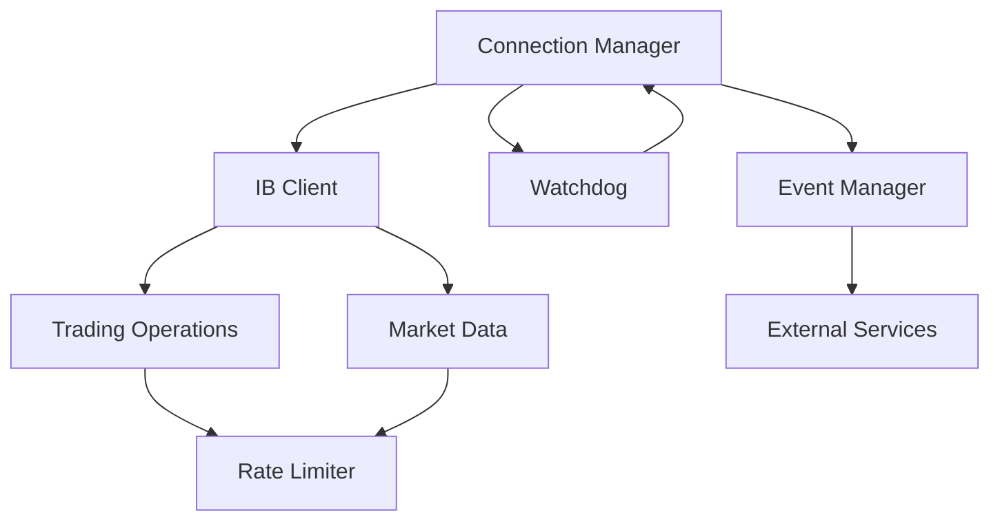

# Python IBKR Connection Layer Architecture

## Overview

The Python IBKR Connection Layer provides a robust, async-first interface to Interactive Brokers TWS API using ib-insync. It handles connection management, automatic recovery, rate limiting, and provides a clean API for trading operations.

## Design Principles

1. **Async-First**: All operations use async/await patterns
2. **Event-Driven**: Leverage ib-insync's event system
3. **Fail Gracefully**: Automatic recovery from disconnections
4. **Rate Limit Aware**: Built-in throttling to prevent violations
5. **Testable**: Mock-friendly design for unit testing

## Component Architecture

### Core Components

```
ibkr_connector/
├── connection.py      # Connection management & lifecycle
├── watchdog.py        # Automatic reconnection logic
├── trading.py         # Order placement & management
├── market_data.py     # Real-time data streaming
├── events.py          # Event aggregation & distribution
├── rate_limiter.py    # Request throttling
└── exceptions.py      # Custom exception hierarchy
```

### Component Interactions



## Connection Manager

The heart of the system, managing the IB connection lifecycle.

### Responsibilities
- Initialize ib-insync IB client
- Manage connection state
- Handle authentication
- Coordinate with Watchdog for recovery
- Emit connection events

### Key Methods
```python
async def connect(host: str, port: int, client_id: int) -> None
async def disconnect() -> None
async def ensure_connected() -> None
def is_connected() -> bool
```

### Events Emitted
- `connection_established`
- `connection_lost`
- `connection_recovered`
- `error_occurred`

## Watchdog Component

Ensures continuous connectivity despite TWS restarts and network issues.

### Features
- Automatic reconnection with exponential backoff
- Daily TWS restart handling
- Connection health monitoring
- State persistence across reconnects

### Configuration
```python
@dataclass
class WatchdogConfig:
    reconnect_interval: float = 2.0
    max_reconnect_interval: float = 60.0
    backoff_factor: float = 2.0
    daily_restart_time: time = time(23, 55)  # 5 mins before midnight
    health_check_interval: float = 30.0
```

## Trading Operations

High-level wrapper for order management.

### Supported Operations
- Place vertical spread orders
- Monitor order status
- Cancel/modify orders
- Position management
- whatIfOrder validation

### Order Flow
```python
# Example vertical spread order
async def place_vertical_spread(
    symbol: str,
    expiry: date,
    call_or_put: str,
    long_strike: float,
    short_strike: float,
    quantity: int,
    order_type: str = "LMT",
    limit_price: float = None
) -> Trade
```

## Market Data Streaming

Efficient real-time data management with caching.

### Features
- Options chain retrieval
- Greeks calculation
- Tick-by-tick data
- Smart subscription management
- Data caching layer

### Subscription Management
```python
async def subscribe_option_chain(
    symbol: str,
    exchange: str = "SMART"
) -> OptionChain

async def subscribe_ticker(
    contract: Contract,
    tick_types: List[str] = None
) -> Ticker

async def unsubscribe(contract: Contract) -> None
```

## Rate Limiting

Prevents API pacing violations (Error 100).

### Strategy
- Token bucket algorithm
- 45 req/sec safety limit (below 50 max)
- Request queuing
- Priority-based scheduling
- Automatic retry with backoff

### Implementation
```python
class RateLimiter:
    def __init__(self, rate: float = 45.0):
        self.rate = rate
        self.tokens = rate
        self.last_update = time.time()
        self._lock = asyncio.Lock()
    
    async def acquire(self, priority: int = 0) -> None:
        """Wait until request can be made safely"""
        # Implementation details...
```

## Event System

Central event bus for system-wide notifications.

### Event Types
- Connection events
- Order events
- Market data events
- Error events
- System events

### Usage Pattern
```python
# Subscribe to events
event_manager.on('order_filled', handle_order_filled)
event_manager.on('connection_lost', handle_connection_lost)

# Emit events
await event_manager.emit('custom_event', data={'key': 'value'})
```

## Error Handling

Comprehensive error management with specific handling for TWS errors.

### Error Categories
1. **Connection Errors** (502, 504)
2. **Rate Limit Errors** (100)
3. **Market Data Errors** (354, 362)
4. **Order Errors** (201, 202)
5. **System Errors** (1100, 1102)

### Error Response Strategy
```python
ERROR_STRATEGIES = {
    100: ThrottleAndRetry(wait=1.0, max_retries=3),
    502: ReconnectStrategy(),
    1100: WatchdogRecovery(),
    # ... more strategies
}
```

## Configuration

Environment-based configuration with sensible defaults.

```python
@dataclass
class IBKRConfig:
    # Connection
    host: str = "127.0.0.1"
    port: int = 7497  # Paper trading
    client_id: int = 1
    
    # Rate limiting
    max_requests_per_second: float = 45.0
    
    # Timeouts
    connection_timeout: float = 30.0
    request_timeout: float = 60.0
    
    # Retry
    max_retries: int = 3
    retry_delay: float = 1.0
    
    # Logging
    log_level: str = "INFO"
    log_all_messages: bool = False
```

## Testing Strategy

### Unit Tests (Linux-compatible)
- Mock IB client for connection tests
- Fake event streams for event handling
- Simulated rate limit scenarios
- Error injection testing

### Integration Tests (Windows required)
- Real TWS connection
- Live market data
- Paper trading orders
- End-to-end scenarios

## Windows Handoff Points

### What Can Be Done on Linux
✅ Write all component code
✅ Unit tests with mocks
✅ Documentation
✅ Architecture design
✅ Error handling logic

### What Requires Windows
❌ TWS connection testing
❌ Real market data validation
❌ Order execution testing
❌ Rate limit verification
❌ Integration tests

### Handoff Protocol
1. Complete all Linux-compatible development
2. Write comprehensive unit tests
3. Document expected behaviors
4. Create integration test suite
5. Mark clear TODO comments for Windows testing
6. Commit with handoff notes

## Performance Considerations

### Optimization Points
- Connection pooling for multiple strategies
- Efficient event dispatch (async)
- Smart caching for contract details
- Batch operations where possible
- Memory-efficient data structures

### Metrics to Monitor
- Request rate (req/sec)
- Connection uptime
- Reconnection frequency
- Order latency
- Data subscription count

## Security Considerations

### Best Practices
- Never log sensitive order details
- Secure storage of connection parameters
- IP whitelist configuration
- Audit trail for all trades
- Encrypted communication where possible

---

This architecture provides a solid foundation that can be developed on Linux and tested on Windows, maintaining clean separation of concerns and robust error handling throughout.